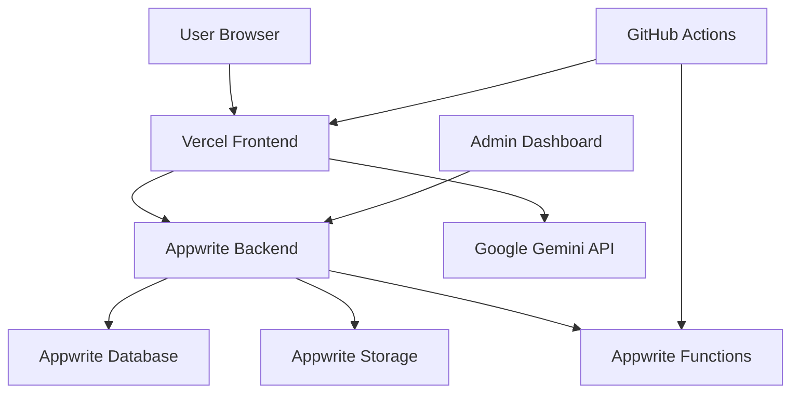

# Design Document

## Overview

The AI Storytelling Platform is a modern web application that combines the power of Google Gemini AI with an intuitive user interface inspired by Gamma's design aesthetic. The platform features gradient backgrounds, smooth animations, and a clean, professional layout that makes AI story generation accessible and enjoyable.

The system architecture follows a modern JAMstack approach with React frontend, Appwrite backend services, and Google Gemini AI integration. The design emphasizes user experience with smooth transitions, responsive layouts, and accessibility compliance.

## Architecture

### High-Level Architecture



### Technology Stack

- **Frontend**: React 18 + TypeScript + Tailwind CSS + Framer Motion
- **Backend**: Appwrite (Authentication, Database, Storage, Functions)
- **AI Integration**: Google Gemini API
- **Deployment**: Vercel (Frontend), Appwrite Cloud/Self-hosted
- **CI/CD**: GitHub Actions
- **Monitoring**: Sentry/Logflare

## Components and Interfaces

### Frontend Components

#### Landing Page Components
- **HeroSection**: Main headline with animated paw-print cursor and gradient background
- **FeatureShowcase**: Grid layout showcasing platform capabilities with hover animations
- **TestimonialsCarousel**: Rotating testimonials with smooth transitions
- **StatsSection**: Usage statistics with animated counters
- **CTASection**: Call-to-action with prominent "Get Started" button
- **ThemeToggle**: Light/dark mode switcher with smooth transitions

#### Authentication Components
- **SignUpForm**: Appwrite-integrated registration with OAuth options
- **SignInForm**: Login form with email/password and social auth
- **OnboardingWizard**: 3-step guided setup process
  - Step 1: Theme and language selection
  - Step 2: Gemini API key input and validation
  - Step 3: Setup completion and welcome

#### Main Application Components
- **ChatInterface**: Story concept input with rich text support
- **StoryGenerator**: AI generation trigger with loading animations
- **StoryDisplay**: Split-pane layout for text and image carousel
- **StorySidebar**: History management with search, filter, and actions
- **StoryCard**: Individual story preview with metadata
- **ExportModal**: PDF/JSON export options

#### Admin Dashboard Components
- **DashboardOverview**: Today's metrics and key statistics
- **AnalyticsCharts**: Interactive charts for user and usage data
- **UserManagement**: User table with actions and filters
- **ErrorMonitoring**: Real-time error feed and alert system
- **SystemHealth**: Performance metrics and status indicators

### API Interfaces

#### Appwrite Collections Schema

**Users Collection**
```typescript
interface User {
  $id: string;
  email: string;
  oauthProvider?: string;
  geminiKey: string; // encrypted
  createdAt: string;
  lastLogin: string;
  settings: {
    theme: 'light' | 'dark';
    language: string;
  };
  isAdmin?: boolean;
}
```

**Stories Collection**
```typescript
interface Story {
  $id: string;
  userId: string;
  title: string;
  content: string;
  images: string[]; // URLs to stored images
  createdAt: string;
  isPinned: boolean;
  tags?: string[];
}
```

**AdminLogs Collection**
```typescript
interface AdminLog {
  $id: string;
  action: string;
  timestamp: string;
  details: Record<string, any>;
  adminId: string;
}
```

#### Gemini API Integration
```typescript
interface GeminiRequest {
  prompt: string;
  apiKey: string;
  options: {
    temperature: number;
    maxTokens: number;
    includeImages: boolean;
  };
}

interface GeminiResponse {
  story: string;
  images?: string[];
  metadata: {
    tokensUsed: number;
    processingTime: number;
  };
}
```

## Data Models

### Frontend State Management

Using React Context and useReducer for global state:

```typescript
interface AppState {
  user: User | null;
  stories: Story[];
  currentStory: Story | null;
  ui: {
    theme: 'light' | 'dark';
    isLoading: boolean;
    sidebarOpen: boolean;
  };
  admin: {
    users: User[];
    analytics: AnalyticsData;
    logs: AdminLog[];
  };
}
```

### Data Flow Patterns

1. **Authentication Flow**: Appwrite SDK → Context → UI Updates
2. **Story Generation**: User Input → Gemini API → Appwrite Storage → UI Update
3. **Real-time Updates**: Appwrite Realtime → Context → Component Re-render
4. **Admin Monitoring**: Scheduled Functions → Database → Dashboard Updates

## Error Handling

### Frontend Error Boundaries
- **Global Error Boundary**: Catches unhandled React errors
- **API Error Handler**: Centralized error processing for all API calls
- **Form Validation**: Real-time validation with user-friendly messages
- **Network Error Recovery**: Automatic retry with exponential backoff

### Backend Error Management
- **Appwrite Function Errors**: Structured error responses with codes
- **Gemini API Errors**: Rate limiting and quota management
- **Database Errors**: Transaction rollback and data consistency
- **Authentication Errors**: Secure error messages without information leakage

### Error Monitoring Integration
```typescript
interface ErrorReport {
  type: 'frontend' | 'backend' | 'api';
  message: string;
  stack?: string;
  userId?: string;
  timestamp: string;
  context: Record<string, any>;
}
```

## Testing Strategy

### Frontend Testing
- **Unit Tests**: Jest + React Testing Library for components
- **Integration Tests**: API integration and user flows
- **E2E Tests**: Playwright for critical user journeys
- **Visual Regression**: Chromatic for UI consistency
- **Accessibility Tests**: axe-core integration

### Backend Testing
- **Function Tests**: Appwrite Functions unit testing
- **API Tests**: Endpoint testing with mock data
- **Database Tests**: Schema validation and data integrity
- **Security Tests**: Authentication and authorization flows

### Performance Testing
- **Load Testing**: Story generation under concurrent users
- **API Rate Limiting**: Gemini API quota management
- **Frontend Performance**: Core Web Vitals monitoring
- **Database Performance**: Query optimization and indexing

### Testing Environments
- **Development**: Local Appwrite instance with test data
- **Staging**: Production-like environment for integration testing
- **Production**: Monitoring and alerting for real user issues

## Security Considerations

### Data Protection
- **API Key Encryption**: AES-256 encryption for Gemini keys
- **HTTPS Enforcement**: All communications over secure channels
- **Input Sanitization**: XSS and injection attack prevention
- **Rate Limiting**: API abuse prevention

### Authentication Security
- **OAuth Integration**: Secure third-party authentication
- **Session Management**: Secure token handling and expiration
- **Admin Access Control**: Role-based permissions with Appwrite
- **Password Security**: Appwrite's built-in security features

### Monitoring and Compliance
- **Audit Logging**: All admin actions tracked
- **Error Monitoring**: Sentry integration for security events
- **Data Retention**: Configurable data lifecycle policies
- **Privacy Compliance**: GDPR-ready data handling

## Performance Optimization

### Frontend Optimization
- **Code Splitting**: Route-based lazy loading
- **Image Optimization**: Next.js Image component with WebP
- **Caching Strategy**: Service worker for offline functionality
- **Bundle Analysis**: Webpack bundle analyzer integration

### Backend Optimization
- **Database Indexing**: Optimized queries for story retrieval
- **Function Caching**: Appwrite Functions with response caching
- **CDN Integration**: Static asset delivery optimization
- **API Response Compression**: Gzip compression for all responses

### Monitoring and Metrics
- **Core Web Vitals**: LCP, FID, CLS tracking
- **API Performance**: Response time and error rate monitoring
- **User Experience**: Real user monitoring with analytics
- **Resource Usage**: Memory and CPU utilization tracking