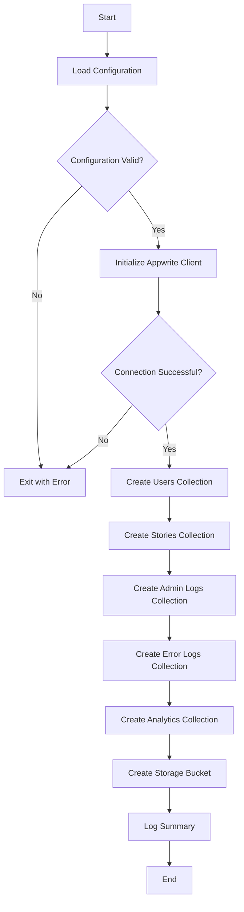

# Design Document: Appwrite Database Setup Script

## Overview

This document outlines the design for a Python script that automates the setup of an Appwrite database with specific collections, attributes, and indexes as defined in the requirements. The script will use the Appwrite Python Server SDK to create the database structure programmatically, reading configuration details from environment variables.

## Architecture

The script will follow a modular architecture with the following components:

1. **Configuration Manager**: Handles loading and validating environment variables
2. **Appwrite Client**: Manages the connection to the Appwrite API
3. **Collection Builders**: Specialized modules for creating each collection type
4. **Storage Manager**: Handles the creation and configuration of storage buckets
5. **Logger**: Provides consistent logging throughout the script

The script will be designed to be idempotent, allowing it to be run multiple times without causing errors or duplicate resources.

## Components and Interfaces

### Configuration Manager

```python
class ConfigManager:
    def __init__(self, env_file=None):
        # Load environment variables from file if provided
        # Otherwise use existing environment variables
        
    def get_required(self, key):
        # Get required environment variable or raise error
        
    def get_optional(self, key, default=None):
        # Get optional environment variable with default
```

### Appwrite Client

```python
class AppwriteClient:
    def __init__(self, config_manager):
        # Initialize Appwrite client with config
        self.client = Client()
        self.client.set_endpoint(config_manager.get_required('APPWRITE_ENDPOINT'))
        self.client.set_project(config_manager.get_required('APPWRITE_PROJECT_ID'))
        self.client.set_key(config_manager.get_required('APPWRITE_API_KEY'))
        
        self.database = Database(self.client)
        self.storage = Storage(self.client)
        
    def create_collection_if_not_exists(self, database_id, collection_id, name):
        # Check if collection exists, create if not
        
    def create_attribute_if_not_exists(self, database_id, collection_id, attribute_type, attribute_key, **options):
        # Check if attribute exists, create if not
        
    def create_index_if_not_exists(self, database_id, collection_id, index_id, attributes, index_type):
        # Check if index exists, create if not
```

### Collection Builder Base Class

```python
class CollectionBuilder:
    def __init__(self, client, database_id):
        self.client = client
        self.database_id = database_id
        
    def create(self):
        # Create collection, attributes, and indexes
        # To be implemented by subclasses
```

### Users Collection Builder

```python
class UsersCollectionBuilder(CollectionBuilder):
    def __init__(self, client, database_id, collection_id="users"):
        super().__init__(client, database_id)
        self.collection_id = collection_id
        
    def create(self):
        # Create Users collection with all required attributes and indexes
```

### Similar builders for other collections:
- StoriesCollectionBuilder
- AdminLogsCollectionBuilder
- ErrorLogsCollectionBuilder
- AnalyticsCollectionBuilder

### Storage Manager

```python
class StorageManager:
    def __init__(self, client):
        self.client = client
        self.storage = Storage(client)
        
    def create_bucket_if_not_exists(self, bucket_id, name, **options):
        # Check if bucket exists, create if not
```

### Logger

```python
class Logger:
    def __init__(self, verbose=True):
        self.verbose = verbose
        
    def info(self, message):
        # Log info message
        
    def error(self, message):
        # Log error message
        
    def success(self, message):
        # Log success message
        
    def warning(self, message):
        # Log warning message
```

## Data Models

### Collection Schemas

The script will create the following collections with their respective attributes and indexes:

#### Users Collection
- **ID**: users
- **Display Name**: Users
- **Attributes**:
  - email (string, size: 255, required: true)
  - geminiKey (string, size: 1000, required: false)
  - settings (string, size: 2000, required: false)
  - isAdmin (boolean, required: false, default: false)
  - createdAt (datetime, required: true)
  - lastLogin (datetime, required: false)
  - name (string, size: 255, required: false)
  - bio (string, size: 1000, required: false)
  - oauthProvider (string, size: 255, required: false)
  - emailVerification (boolean, required: false)
  - disabled (boolean, required: false)
- **Indexes**:
  - email_index (unique, attributes: ["email"])
  - created_at_index (key, attributes: ["createdAt"])

#### Stories Collection
- **ID**: stories
- **Display Name**: Stories
- **Attributes**:
  - userId (string, size: 255, required: true)
  - title (string, size: 500, required: true)
  - content (string, size: 10000, required: true)
  - images (string, size: 2000, required: false)
  - isPinned (boolean, required: false, default: false)
  - createdAt (datetime, required: true)
  - tags (string, size: 1000, required: false)
- **Indexes**:
  - user_stories_index (key, attributes: ["userId", "createdAt"])
  - created_at_index (key, attributes: ["createdAt"])

#### Admin Logs Collection
- **ID**: admin_logs
- **Display Name**: Admin Logs
- **Attributes**:
  - action (string, size: 255, required: true)
  - adminId (string, size: 255, required: true)
  - details (string, size: 5000, required: false)
  - timestamp (datetime, required: true)
- **Indexes**:
  - timestamp_index (key, attributes: ["timestamp"])

#### Error Logs Collection
- **ID**: error_logs
- **Display Name**: Error Logs
- **Attributes**:
  - type (string, size: 50, required: true)
  - message (string, size: 1000, required: true)
  - stack (string, size: 5000, required: false)
  - userId (string, size: 255, required: false)
  - context (string, size: 2000, required: false)
  - severity (string, size: 20, required: true)
  - resolved (boolean, required: false, default: false)
  - timestamp (datetime, required: true)
- **Indexes**:
  - timestamp_index (key, attributes: ["timestamp"])
  - severity_index (key, attributes: ["severity"])

#### Analytics Collection
- **ID**: analytics
- **Display Name**: Analytics
- **Attributes**:
  - eventId (string, size: 255, required: true)
  - userId (string, size: 255, required: false)
  - eventType (string, size: 100, required: true)
  - resourceId (string, size: 255, required: false)
  - resourceType (string, size: 100, required: false)
  - timestamp (datetime, required: true)
  - metadata (string, size: 2000, required: false)
- **Indexes**:
  - timestamp_index (key, attributes: ["timestamp"])
  - user_events_index (key, attributes: ["userId", "timestamp"])
  - event_type_index (key, attributes: ["eventType"])

### Storage Bucket

- **ID**: storytelling-images
- **Name**: Storytelling Images
- **Configuration**:
  - Maximum file size: 10MB
  - Allowed extensions: jpg, jpeg, png, gif, webp
  - Compression: gzip
  - Encryption: enabled
  - Antivirus: enabled

## Error Handling

The script will implement comprehensive error handling to ensure robustness:

1. **Configuration Errors**: Validate all required environment variables before attempting any operations
2. **Connection Errors**: Handle connection issues with clear error messages
3. **Resource Existence**: Check if resources exist before attempting to create them
4. **Permission Errors**: Handle permission issues with appropriate error messages
5. **API Errors**: Handle Appwrite API errors with detailed error information

Error handling will follow this pattern:

```python
try:
    # Attempt operation
except AppwriteException as e:
    if e.code == 409:  # Resource already exists
        logger.warning(f"Resource already exists: {e.message}")
    else:
        logger.error(f"Appwrite API error: {e.message}")
        # Decide whether to continue or exit based on error severity
except Exception as e:
    logger.error(f"Unexpected error: {str(e)}")
    # Decide whether to continue or exit based on error severity
```

## Testing Strategy

The script will include the following testing approaches:

1. **Unit Tests**: Test individual components in isolation
   - Test configuration loading
   - Test error handling
   - Test resource existence checking

2. **Integration Tests**: Test interaction with the Appwrite API
   - Test collection creation
   - Test attribute creation
   - Test index creation
   - Test bucket creation

3. **End-to-End Tests**: Test the complete script execution
   - Test creating a complete database from scratch
   - Test running the script on an existing database
   - Test error scenarios

4. **Mocking**: Use mocking to test error scenarios without requiring an actual Appwrite instance

## Implementation Flow

The script will follow this execution flow:



## Security Considerations

1. **API Key Security**: The script will read the API key from environment variables rather than hardcoding it
2. **Least Privilege**: The script will require an API key with only the necessary permissions
3. **Error Messages**: Error messages will be informative but won't expose sensitive information
4. **Idempotency**: The script will be idempotent to prevent duplicate resources or data corruption

## Deployment and Usage

The script will be designed for easy deployment and usage:

1. **Dependencies**: Minimal dependencies (only the Appwrite Python SDK and dotenv for environment variables)
2. **Documentation**: Clear documentation on required environment variables and usage
3. **Example Usage**: Example commands for running the script
4. **Docker Support**: Option to run the script in a Docker container for consistent execution environment

## Configuration

The script will require the following environment variables:

```
APPWRITE_ENDPOINT=https://fra.cloud.appwrite.io/v1
APPWRITE_PROJECT_ID=felearn
APPWRITE_API_KEY=standard_db59193f87cb25d0f9e7d07fc3eec0e60e04c4280f9d989e374a6a44281b5a340781bb86c0764ed566a2c23f1697f2bd7a177a6091f355149e767ea5ea33680248dd11c8029995fa50ba467811e7307f673432bd8500058a97141693501f8953df5e5ca552237dd1b0add8f382bda977bc2da23043e37d9ccc0cdb89e267961f
APPWRITE_DATABASE_ID=687a8ae6003b5969331a
```

Optional environment variables:

```
APPWRITE_USERS_COLLECTION_ID=users
APPWRITE_STORIES_COLLECTION_ID=stories
APPWRITE_ADMIN_LOGS_COLLECTION_ID=admin_logs
APPWRITE_ERROR_LOGS_COLLECTION_ID=error_logs
APPWRITE_ANALYTICS_COLLECTION_ID=analytics
APPWRITE_IMAGES_BUCKET_ID=storytelling-images
```