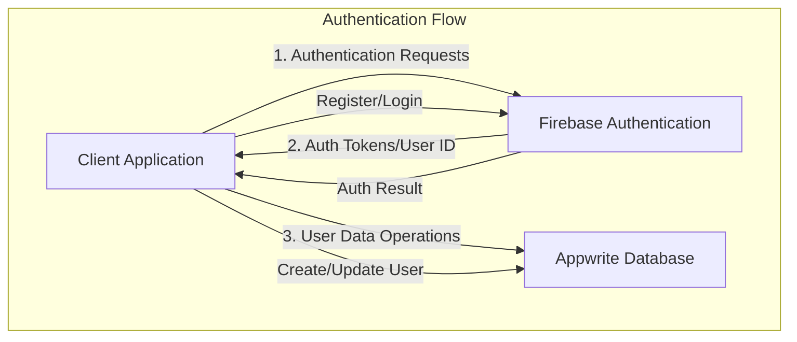

# Design Document: Firebase Authentication with Appwrite User Storage

## Overview

This design outlines the implementation of a hybrid authentication system that uses Firebase for email authentication while storing user data in Appwrite. The system will handle user registration, login, and profile management by coordinating between Firebase Authentication services and Appwrite database storage.

## Architecture

The architecture follows a client-side integration pattern where the application directly communicates with both Firebase and Appwrite services:



### Key Components

1. **Authentication Service**: A service layer that interfaces with Firebase Authentication
2. **User Service**: A service layer that interfaces with Appwrite for user data operations
3. **Auth State Manager**: Manages authentication state across the application
4. **User Synchronization Logic**: Ensures user data consistency between Firebase and Appwrite

## Components and Interfaces

### Authentication Service

```typescript
interface AuthService {
  // Firebase Authentication methods
  registerWithEmail(email: string, password: string): Promise<UserCredential>;
  loginWithEmail(email: string, password: string): Promise<UserCredential>;
  logout(): Promise<void>;
  resetPassword(email: string): Promise<void>;
  getCurrentUser(): User | null;
  onAuthStateChanged(callback: (user: User | null) => void): Unsubscribe;
}
```

### User Service

```typescript
interface UserService {
  // Appwrite User operations
  createUser(userId: string, userData: UserData): Promise<void>;
  getUserById(userId: string): Promise<UserData | null>;
  updateUser(userId: string, userData: Partial<UserData>): Promise<void>;
  deleteUser(userId: string): Promise<void>;
}

interface UserData {
  id: string;          // Firebase UID used as the primary key
  email: string;
  displayName?: string;
  createdAt: Date;
  updatedAt: Date;
  // Additional user profile fields as needed
}
```

### Auth State Manager

```typescript
interface AuthStateManager {
  isAuthenticated: boolean;
  currentUser: User | null;
  userProfile: UserData | null;
  
  initialize(): Promise<void>;
  handleAuthStateChange(firebaseUser: FirebaseUser | null): Promise<void>;
  clearAuthState(): void;
}
```

## Data Models

### User Document in Appwrite

```json
{
  "id": "firebase_user_uid",
  "email": "user@example.com",
  "displayName": "User Name",
  "createdAt": "2023-07-22T12:00:00Z",
  "updatedAt": "2023-07-22T12:00:00Z",
  "lastLogin": "2023-07-22T12:00:00Z",
  "profileData": {
    // Additional profile information
  }
}
```

### Appwrite Collection Structure

The Appwrite database will have a "users" collection with the following attributes:
- id (string, primary key): Firebase UID
- email (string, indexed)
- displayName (string, optional)
- createdAt (datetime)
- updatedAt (datetime)
- lastLogin (datetime)
- profileData (json)

## Authentication Flow

### Registration Flow

1. User enters email and password in the registration form
2. Client application calls Firebase Authentication to create a new user
3. On successful Firebase registration:
   - Extract the Firebase UID and user information
   - Create a corresponding user document in Appwrite using the Firebase UID as the document ID
   - Initialize the user's authentication state in the application
4. Handle any errors during the process and provide appropriate feedback

### Login Flow

1. User enters email and password in the login form
2. Client application authenticates with Firebase Authentication
3. On successful Firebase authentication:
   - Extract the Firebase UID
   - Query Appwrite to retrieve the user document using the Firebase UID
   - If the user document exists, load the user profile data
   - If the user document doesn't exist (edge case), create a new user document in Appwrite
   - Initialize the user's authentication state in the application
4. Handle any errors during the process and provide appropriate feedback

### Logout Flow

1. User initiates logout
2. Client application signs out from Firebase Authentication
3. Clear the local authentication state
4. Redirect to the login page or home page as appropriate

## Error Handling

### Firebase Authentication Errors

The system will handle common Firebase authentication errors including:
- Invalid email format
- Weak password
- Email already in use
- User not found
- Wrong password
- Too many requests (rate limiting)

Each error will be mapped to a user-friendly message and appropriate recovery action.

### Appwrite Operation Errors

The system will handle Appwrite errors including:
- Network errors
- Permission errors
- Document not found
- Validation errors

The application will implement retry logic for transient errors and graceful degradation for persistent errors.

## Security Considerations

1. **Token Handling**: Firebase authentication tokens will be securely stored and transmitted
2. **Data Validation**: All user inputs will be validated on both client and server sides
3. **Rate Limiting**: Implement rate limiting for authentication attempts to prevent brute force attacks
4. **Secure Communication**: All API calls will use HTTPS
5. **Minimal Data Transfer**: Only necessary user data will be transferred between services

## Testing Strategy

### Unit Tests

- Test authentication service methods in isolation with mocked Firebase responses
- Test user service methods in isolation with mocked Appwrite responses
- Test auth state manager logic

### Integration Tests

- Test the complete registration flow from UI to Firebase to Appwrite
- Test the complete login flow
- Test error handling scenarios
- Test authentication state persistence

### Security Tests

- Test for common authentication vulnerabilities
- Test rate limiting functionality
- Test token handling security

## Implementation Considerations

1. **Firebase SDK**: The implementation will use the official Firebase Web SDK for authentication
2. **Appwrite SDK**: The implementation will use the official Appwrite Web SDK for database operations
3. **State Management**: Authentication state will be managed using React Context or a state management library
4. **Error Handling**: A centralized error handling approach will be used for consistent error messages
5. **Configuration**: Firebase and Appwrite configuration will be environment-based for different deployment environments