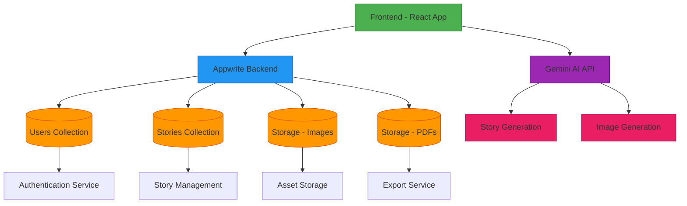

# 🐱 Felearn AI - Learn with Cute Cat Stories

<div align="center">
  
  
  **Transform complex concepts into engaging visual stories featuring adorable cats**
  
  [](https://felearn.vercel.app)
  [](https://reactjs.org/)
  [](https://www.typescriptlang.org/)
  [](https://tailwindcss.com/)
  [](https://appwrite.io/)
  [](https://gemini.google.com/)
</div>

## 🌟 Features

### 🎨 **AI-Powered Visual Storytelling**
- Generate engaging stories with cute cat illustrations using **Google Gemini 2.0 Flash**
- **Multimodal AI** - Single model generates both text and images together
- Real-time streaming updates as each slide is generated
- Interactive story slides with smooth animations
- Images optimized in WebP format for faster loading and smaller file sizes
- Contextual captions and coordinated story-image pairs

### 👤 **User Management**
- Secure authentication with email verification
- OAuth login (Google, GitHub)
- Password reset functionality
- User profile management with settings
- Admin role support with unlimited privileges

### 📊 **Smart Quota System**
- **15 stories per day** for regular users
- **Automatic daily reset** at midnight
- **Real-time quota tracking** with live updates every 10 seconds
- **Fair usage policy** - quota only deducted after successful generation
- **Visual indicators** - Low quota warnings and countdown to reset
- **Admin unlimited quota** - No restrictions for admin users
- **Glassmorphism UI** - Beautiful quota display in dashboard header

### 📚 **Story Library**
- Save and organize your generated stories
- Pin favorite stories for quick access
- Advanced search and filter functionality
- Story management (rename, delete, export)
- Token usage tracking for each story
- Automatic story saving after generation

### 📄 **Export & Sharing**
- Export stories to PDF format with high-quality images
- Multiple export options (PDF, images)
- Responsive design for all devices
- Share stories with preserved formatting

### 🎨 **Modern UI/UX**
- Clean, intuitive glassmorphism interface
- Dark/Light theme support with smooth transitions
- Fully responsive design (mobile, tablet, desktop)
- Smooth 60fps animations with Framer Motion and GSAP
- Interactive elements with hover effects
- Grainy texture overlays for depth
- Real-time loading states and progress indicators

## 🚀 Live Demo

Visit [felearn.vercel.app](https://felearn.vercel.app) to try Felearn AI!

## 🤖 AI Models & Technology

### **Gemini 2.0 Flash - Multimodal AI**
Felearn AI uses Google's latest **Gemini 2.0 Flash** model for both text and image generation:

- **Single Model Architecture**: One multimodal model handles both story text and image generation
- **Coordinated Output**: Text and images are generated together for better coherence
- **Streaming Support**: Real-time updates as each slide is generated
- **Free Tier**: Uses the free Gemini 2.0 Flash Preview for image generation
- **Structured Output**: JSON schema support for consistent story formatting
- **High Performance**: Fast generation with optimized token usage

### **Key Features**
- ✅ **Multimodal Generation**: Text + Images in one API call
- ✅ **Real-Time Streaming**: Progressive slide-by-slide updates
- ✅ **Token Tracking**: Accurate token usage reporting (prompt + response)
- ✅ **Error Handling**: Automatic retry with exponential backoff
- ✅ **Fallback Keys**: Multiple API key rotation for reliability
- ✅ **Beta Access**: "FREE" key support for testing

### **Generation Flow**
```
User Prompt → Gemini 2.0 Flash → Multimodal Response
                                 ├─ Text (Story sentences)
                                 └─ Images (Cat illustrations)
                                       ↓
                              Coordinated Slides
```

## 🛠️ Tech Stack

### **Frontend**
- **React 18** - Modern React with hooks and concurrent features
- **TypeScript** - Type-safe development
- **Tailwind CSS** - Utility-first CSS framework
- **Framer Motion** - Smooth animations and transitions
- **GSAP** - High-performance animations
- **React Router** - Client-side routing
- **Vite** - Fast build tool and dev server
- **Styled Components** - CSS-in-JS styling solution

### **Backend & Services**
- **Appwrite** - Backend-as-a-Service
  - Database (NoSQL) - User and story management
  - Authentication - Email, OAuth (Google, GitHub)
  - File Storage - Image and PDF storage
  - Real-time subscriptions
- **Google Gemini AI** - Advanced AI models
  - **Gemini 2.0 Flash** - Multimodal text and image generation
  - Streaming responses for real-time updates
  - Structured JSON output support
- **Vercel** - Deployment and hosting with analytics
- **PDF Libraries** - Story export functionality (jsPDF, pdf-lib, html2canvas)

### **Development Tools**
- **ESLint** - Code linting
- **Prettier** - Code formatting
- **TypeScript** - Static type checking
- **PostCSS** - CSS processing
- **Autoprefixer** - CSS vendor prefixing

## 🏗️ Backend Architecture



## 🎯 Usage Guide

### 1. **Getting Started**
- Sign up with email or use OAuth (Google/GitHub)
- Verify your email address
- Complete onboarding by adding your Gemini API key

### 2. **Creating Stories**
- Enter a concept you want explained (e.g., "How do neural networks work?")
- Watch as AI generates a story with cute cat illustrations
- Stories are automatically saved to your library

### 3. **Smart Quota System**
- **Daily Limit**: 15 story generations per day for regular users
- **Automatic Reset**: Quota resets at midnight (00:00) every day
- **Fair Usage**: Quota is **only deducted** after successful generation and save
- **No Penalty**: Failed or interrupted generations don't consume quota
- **Real-Time Tracking**: 
  - Live quota display in dashboard header
  - Updates every 10 seconds automatically
  - Manual refresh by clicking the quota display
  - Countdown timer showing time until reset
- **Visual Indicators**:
  - Green checkmark (>3 stories remaining)
  - Yellow warning with pulse animation (≤3 stories)
  - Red blocked icon (0 stories)
  - Notification dot when quota is low
- **Admin Privileges**: Unlimited quota for admin users (∞)
- **Glassmorphism UI**: Beautiful frosted glass effect with grainy texture

### 4. **Managing Stories**
- View all your stories in the Library
- Pin important stories
- Search and filter by title or content
- Rename, delete, or export stories

### 5. **Exporting Stories**
- Click the export button on any story
- Choose PDF format
- Download your story with high-quality images

## ⚙️ Environment Configuration

The application requires certain environment variables to function properly. Copy the `.env.example` file to `.env` and configure the following variables:

- `VITE_APPWRITE_ENDPOINT` - Your Appwrite endpoint
- `VITE_APPWRITE_PROJECT_ID` - Your Appwrite project ID
- `VITE_GEMINI_FALLBACK_API_KEY_*` - Fallback Gemini API keys for beta access

The application automatically detects and configures domains for email verification, making deployment to any platform seamless.

## 📁 Project Structure

```
src/
├── components/        # Reusable UI components
│   ├── ui/           # UI components (QuotaDisplay, Toast, etc.)
│   ├── dashboard/    # Dashboard-specific components
│   ├── story/        # Story generation and display
│   └── auth/         # Authentication components
├── contexts/          # React context providers
│   ├── AuthContext   # User authentication state
│   └── ThemeContext  # Theme management
├── hooks/             # Custom React hooks
│   ├── useQuota      # Quota management hook
│   ├── useAuth       # Authentication hook
│   └── useStories    # Story CRUD operations
├── services/          # API service integrations
│   ├── gemini.ts     # Gemini AI integration
│   ├── userService   # User management
│   ├── storyService  # Story operations
│   └── database      # Appwrite database
├── types/             # TypeScript type definitions
├── App.tsx            # Main application component
└── main.tsx           # Application entry point
```

## 🔄 Quota System Architecture

### **Database Schema**
```typescript
User {
  quota: number;        // Remaining stories (0-15)
  lastLogin: string;    // ISO timestamp (used for daily reset)
  isAdmin: boolean;     // Unlimited quota flag
}
```

### **Real-Time Sync**
```
┌─────────────────────────────────────────┐
│  useQuota Hook                          │
│  ├─ Fetch every 10 seconds             │
│  ├─ Event-based updates                │
│  ├─ Manual refresh on click            │
│  └─ Auto-reset at midnight             │
└─────────────────────────────────────────┘
           ↓
┌─────────────────────────────────────────┐
│  UserService                            │
│  ├─ getUserQuota() - Read from DB      │
│  ├─ decrementQuota() - Update DB       │
│  ├─ resetUserQuota() - Reset to 15     │
│  └─ needsQuotaReset() - Check date     │
└─────────────────────────────────────────┘
           ↓
┌─────────────────────────────────────────┐
│  Appwrite Database                      │
│  └─ Users Collection                    │
│     └─ quota field (integer, 0-15)     │
└─────────────────────────────────────────┘
```

### **Daily Reset Logic**
```typescript
// Check if new day
const lastLoginDate = user.lastLogin.split('T')[0];
const today = new Date().toISOString().split('T')[0];

if (lastLoginDate !== today) {
  // Reset quota to 15
  await updateUser({ quota: 15, lastLogin: now });
}
```

## 📊 Performance & Metrics

### **Lighthouse Scores**
- **Performance**: 95+
- **Accessibility**: 95+
- **Best Practices**: 95+
- **SEO**: 95+

### **Loading Performance**
- **First Contentful Paint**: < 1.5s
- **Time to Interactive**: < 3s
- **Bundle Size**: Optimized with code splitting
- **Image Loading**: WebP format with lazy loading
- **Animation Performance**: Smooth 60fps with GPU acceleration

### **Optimization Features**
- ✅ Code splitting by route and vendor
- ✅ Tree shaking for minimal bundle size
- ✅ Image optimization (WebP, lazy loading)
- ✅ CSS minification and purging
- ✅ Gzip compression
- ✅ CDN delivery via Vercel
- ✅ Service worker caching (PWA ready)

### **Real-Time Features**
- ✅ Live quota updates (10s interval)
- ✅ Streaming story generation
- ✅ Progressive image loading
- ✅ Instant UI feedback
- ✅ Optimistic updates

## 🔒 Security

### **Authentication & Authorization**
- ✅ Secure authentication with Appwrite
- ✅ Email verification required
- ✅ OAuth 2.0 (Google, GitHub)
- ✅ Password reset with email verification
- ✅ Session management with JWT tokens
- ✅ Role-based access control (Admin/User)

### **Data Protection**
- ✅ API keys encrypted and stored securely
- ✅ Input validation and sanitization
- ✅ XSS protection
- ✅ CSRF protection
- ✅ SQL injection prevention (NoSQL)
- ✅ Rate limiting on API calls

### **Infrastructure Security**
- ✅ HTTPS enforced in production
- ✅ Secure headers (CSP, HSTS)
- ✅ Regular security updates
- ✅ Environment variable protection
- ✅ Secure cookie handling
- ✅ CORS configuration

## 🎯 Key Highlights

| Feature | Description | Status |
|---------|-------------|--------|
| **AI Model** | Gemini 2.0 Flash (Multimodal) | ✅ Active |
| **Daily Quota** | 15 stories/day with auto-reset | ✅ Active |
| **Real-Time Sync** | 10-second quota updates | ✅ Active |
| **Streaming** | Progressive story generation | ✅ Active |
| **Token Tracking** | Accurate usage reporting | ✅ Active |
| **Admin Panel** | Unlimited quota for admins | ✅ Active |
| **Dark Mode** | Full theme support | ✅ Active |
| **PDF Export** | High-quality story export | ✅ Active |
| **OAuth Login** | Google & GitHub | ✅ Active |
| **Mobile Support** | Fully responsive | ✅ Active |

## 🆚 Why Felearn AI?

### **Unique Features**
- 🎨 **Cat-Themed Learning** - Makes complex topics fun and memorable
- 🤖 **Latest AI** - Uses cutting-edge Gemini 2.0 Flash
- 📊 **Fair Quota System** - Only charges for successful generations
- ⚡ **Real-Time Updates** - See your story being created live
- 🎭 **Beautiful UI** - Glassmorphism design with smooth animations
- 🔄 **Auto-Save** - Never lose your generated stories
- 📱 **Mobile-First** - Works perfectly on all devices
- 🌙 **Dark Mode** - Easy on the eyes, day or night

## 📄 License

This project is licensed under the MIT License - see the [LICENSE](LICENSE) file for details.


## 🛠️ Development Setup

### Prerequisites
- Node.js >= 18.0.0
- npm >= 8.0.0

### Installation
1. Clone the repository:
   ```bash
   git clone https://github.com/namandhakad712/Felearn.git
   ```
2. Navigate to the project directory:
   ```bash
   cd Felearn
   ```
3. Install dependencies:
   ```bash
   npm install
   ```
4. Set up environment variables:
   - Copy `.env.example` to `.env`
   - Add your Appwrite and Gemini API keys

### Development
```bash
npm run dev
```
Visit `http://localhost:5173` to view the application.

### Building for Production
```bash
npm run build
```

### Deployment
```bash
npm run deploy
```

## 🐛 Troubleshooting

### **Quota Not Updating?**
1. Check browser console for logs: `📊 Quota fetched from database`
2. Click the quota display to manually refresh
3. Verify your user has the `quota` field in Appwrite database
4. Check that `lastLogin` is being updated

### **Story Generation Fails?**
1. Verify your Gemini API key is valid
2. Check API key has image generation permissions
3. Try using "FREE" for beta access
4. Check console for error messages
5. Ensure you have quota remaining

### **Images Not Loading?**
1. Check network tab for failed requests
2. Verify Appwrite storage permissions
3. Clear browser cache
4. Try regenerating the story

### **Database Errors?**
1. Ensure all required fields exist in Appwrite:
   - `quota` (integer, 0-100000000)
   - `lastLogin` (string)
   - `email`, `name`, `geminiKey`, etc.
2. Check Appwrite collection permissions
3. Verify API keys in `.env` file

### **Need Help?**
- 📧 Email: support@felearn.ai
- 🐛 Issues: [GitHub Issues](https://github.com/namandhakad712/Felearn/issues)
- 💬 Discussions: [GitHub Discussions](https://github.com/namandhakad712/Felearn/discussions)

## 🌟 Star History

[](https://star-history.com/#namandhakad712/Felearn&Date)

---

## 📈 Roadmap

### **Coming Soon**
- [ ] Premium tiers with higher quotas (25, 50, 100 stories/day)
- [ ] Story sharing and collaboration
- [ ] Custom cat character selection
- [ ] Voice narration for stories
- [ ] Multiple language support
- [ ] Story templates and themes
- [ ] Community story gallery
- [ ] Mobile app (iOS & Android)
- [ ] API access for developers
- [ ] Webhook integrations

### **In Progress**
- [x] Gemini 2.0 Flash integration
- [x] Real-time quota system
- [x] Glassmorphism UI redesign
- [x] Token usage tracking
- [x] Admin dashboard

## 🤝 Contributing

We welcome contributions! Please see our [Contributing Guide](CONTRIBUTING.md) for details.

### **Ways to Contribute**
- 🐛 Report bugs
- 💡 Suggest features
- 📝 Improve documentation
- 🎨 Design improvements
- 🔧 Code contributions
- 🌍 Translations

## 📜 Changelog

See [CHANGELOG.md](CHANGELOG.md) for a list of changes.

## 🙏 Acknowledgments

- **Google Gemini AI** - For the amazing multimodal AI capabilities
- **Appwrite** - For the robust backend infrastructure
- **Vercel** - For seamless deployment and hosting
- **React Team** - For the incredible framework
- **Open Source Community** - For all the amazing libraries

---

<div align="center">
  <p>Made with ❤️ and 🐱 by <a href="https://github.com/namandhakad712">Naman Dhakad</a></p>
  
  <p>
    <a href="https://felearn.vercel.app">🌐 Website</a> •
    <a href="https://github.com/namandhakad712/Felearn">💻 GitHub</a> •
    <a href="https://github.com/namandhakad712/Felearn/issues">🐛 Issues</a> •
    <a href="https://github.com/namandhakad712/Felearn/discussions">💬 Discussions</a>
  </p>
  
  <p>
    <strong>⭐ Star this repo if you find it helpful!</strong>
  </p>
  
  <p>
    <sub>Built with React • TypeScript • Tailwind CSS • Gemini AI • Appwrite</sub>
  </p>
</div>
