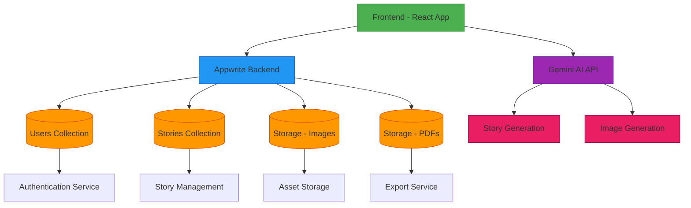

# 🐱 Felearn AI - Learn with Cute Cat Stories

<div align="center">
  
  
  **Transform complex concepts into engaging visual stories featuring adorable cats**
  
  [](https://felearn.vercel.app)
  [](https://reactjs.org/)
  [](https://www.typescriptlang.org/)
  [](https://tailwindcss.com/)
  [](https://appwrite.io/)
  [](https://gemini.google.com/)
</div>

## 🌟 Features

### 🎨 **AI-Powered Visual Storytelling**
- Generate engaging stories with cute cat illustrations using Google Gemini AI
- Real-time image generation with contextual captions
- Interactive story slides with smooth animations
- Images now optimized in WebP format for faster loading and smaller file sizes

### 👤 **User Management**
- Secure authentication with email verification
- OAuth login (Google, GitHub)
- Password reset functionality
- User profile management

### 📚 **Story Library**
- Save and organize your generated stories
- Pin favorite stories
- Search and filter functionality
- Story management (rename, delete, export)

### 📄 **Export & Sharing**
- Export stories to PDF format
- High-quality image preservation
- Responsive design for all devices

### 🎨 **Modern UI/UX**
- Clean, intuitive interface
- Dark/Light theme support
- Responsive design
- Smooth animations and transitions
- Interactive elements with GSAP and Framer Motion

## 🚀 Live Demo

Visit [felearn.vercel.app](https://felearn.vercel.app) to try Felearn AI!

## 🛠️ Tech Stack

### **Frontend**
- **React 18** - Modern React with hooks and concurrent features
- **TypeScript** - Type-safe development
- **Tailwind CSS** - Utility-first CSS framework
- **Framer Motion** - Smooth animations and transitions
- **GSAP** - High-performance animations
- **React Router** - Client-side routing
- **Vite** - Fast build tool and dev server
- **Styled Components** - CSS-in-JS styling solution

### **Backend & Services**
- **Appwrite** - Backend-as-a-Service
  - Database (NoSQL)
  - Authentication
  - File Storage
  - Real-time subscriptions
- **Google Gemini AI** - Story and image generation
- **Vercel** - Deployment and hosting
- **PDF Libraries** - Story export functionality (jsPDF, pdf-lib)

### **Development Tools**
- **ESLint** - Code linting
- **Prettier** - Code formatting
- **TypeScript** - Static type checking
- **PostCSS** - CSS processing
- **Autoprefixer** - CSS vendor prefixing

## 🏗️ Backend Architecture



## 🎯 Usage Guide

### 1. **Getting Started**
- Sign up with email or use OAuth (Google/GitHub)
- Verify your email address
- Complete onboarding by adding your Gemini API key

### 2. **Creating Stories**
- Enter a concept you want explained (e.g., "How do neural networks work?")
- Watch as AI generates a story with cute cat illustrations
- Stories are automatically saved to your library

### 3. **Story Generation Limits**
- Each user has a daily quota of 15 story generations
- Quota is **only deducted** after a story is successfully generated and saved
- If generation fails or is interrupted, your quota is **not** consumed
- Check your remaining quota in the top-right corner of the dashboard
- Stories are now allocated with smarter resource management for optimal performance

### 4. **Managing Stories**
- View all your stories in the Library
- Pin important stories
- Search and filter by title or content
- Rename, delete, or export stories

### 5. **Exporting Stories**
- Click the export button on any story
- Choose PDF format
- Download your story with high-quality images

## ⚙️ Environment Configuration

The application requires certain environment variables to function properly. Copy the `.env.example` file to `.env` and configure the following variables:

- `VITE_APPWRITE_ENDPOINT` - Your Appwrite endpoint
- `VITE_APPWRITE_PROJECT_ID` - Your Appwrite project ID
- `VITE_GEMINI_FALLBACK_API_KEY_*` - Fallback Gemini API keys for beta access

The application automatically detects and configures domains for email verification, making deployment to any platform seamless.

## 📁 Project Structure

```
src/
├── components/        # Reusable UI components
├── contexts/          # React context providers
├── hooks/             # Custom React hooks
├── lib/               # Utility functions and helpers
├── pages/             # Page components
├── services/          # API service integrations
├── types/             # TypeScript type definitions
├── App.tsx            # Main application component
└── main.tsx           # Application entry point
```

## 📊 Performance

- **Lighthouse Score**: 95+ (Performance, Accessibility, Best Practices, SEO)
- **Bundle Size**: Optimized for fast loading
- **First Contentful Paint**: < 1.5s
- **Time to Interactive**: < 3s
- **Image Loading**: Significantly improved with WebP format migration and optimized asset delivery
- **Animation Performance**: Smooth 60fps animations with Framer Motion and GSAP

## 🔒 Security

- Secure authentication with Appwrite
- API keys encrypted and stored securely
- Input validation and sanitization
- HTTPS enforced in production
- Regular security updates

## 📄 License

This project is licensed under the MIT License - see the [LICENSE](LICENSE) file for details.


## 🛠️ Development Setup

### Prerequisites
- Node.js >= 18.0.0
- npm >= 8.0.0

### Installation
1. Clone the repository:
   ```bash
   git clone https://github.com/namandhakad712/Felearn.git
   ```
2. Navigate to the project directory:
   ```bash
   cd Felearn
   ```
3. Install dependencies:
   ```bash
   npm install
   ```
4. Set up environment variables:
   - Copy `.env.example` to `.env`
   - Add your Appwrite and Gemini API keys

### Development
```bash
npm run dev
```
Visit `http://localhost:5173` to view the application.

### Building for Production
```bash
npm run build
```

### Deployment
```bash
npm run deploy
```


## 🌟 Star History

[](https://star-history.com/#namandhakad712/Felearn&Date)

---

<div align="center">
  <p>Made with ❤️ and 🐱 by Naman/p>
  <p>
    <a href="https://felearn.vercel.app">Website</a> •
    <a href="https://github.com/namandhakad712/Felearn">GitHub</a> •
  </p>
</div>
